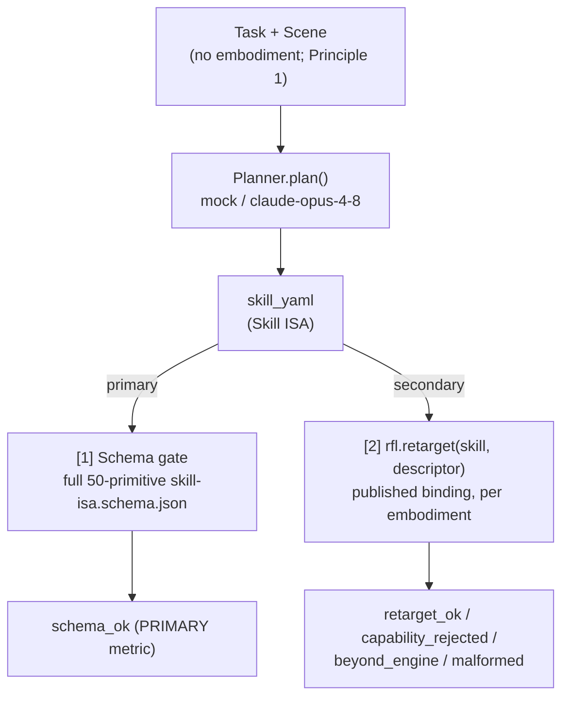

# cobel

Demand-side existence proof for [RFL](https://github.com/robotfoundationlayer/rfl): demonstrate
that a real foundation model can emit valid, retargetable RFL **Skill ISA**.

`cobel` is the matched half of [Milchick](https://github.com/robotfoundationlayer/rfl/blob/main/docs/design/2026-05-31-pincherx-existence-proof-design.md)
(the supply-side proof, a real embodiment). Milchick holds the embodiment fixed and the planner
trivial; `cobel` holds the planner real (Claude) and the embodiment a set of descriptors. Together
they bracket the RFL roadmap's "(VLA, embodiment) pair" existence-proof milestone.

## What it proves

A frontier foundation model, given the Skill ISA spec + a task + a scene (but **not** the
embodiment), emits valid, schema-conformant, retargetable Skill ISA across novel tasks — at a
measured pass rate (`pass@1` / `pass@k`, spec-only vs few-shot). It does **not** claim that
action-token VLAs (π0 / OpenVLA / Octo) emit RFL — those operate below the Skill ISA; the ISA's
natural emitter is the planner / VLM tier.

## How it works

The same `Planner` interface backs both the offline mock (the CI gate) and the real
`claude-opus-4-8` emitter, so the proof is a one-flag swap (`--planner mock|claude`). The model
never sees the embodiment; the descriptor enters only at retarget. Schema-validity is the
headline metric (it does not depend on engine coverage); retarget is a secondary, four-valued
check bounded by how many of the 50 primitives the reference engine implements.

## Layout

- `planner/` — the planner-adapter contract + a deterministic mock + a real Claude emitter
- `harness/` — schema + retarget validation; pass-rate reporting
- `tasks/` — task + scene inputs (novel; not the RFL examples)
- `run.py` — `--planner mock|claude --mode spec-only|few-shot`
- `results/` — generated pass-rate tables (the published artifact)

Authoritative design: `rfl/docs/design/2026-06-01-demand-side-existence-proof-design.md`.

## Results (2026-06-01, `claude-opus-4-8`, samples = 5 per task)

**Headline — schema validity** (does the model emit valid full-spec Skill ISA?). The model
is given the task + scene + the Skill ISA spec digest + the full `skill-isa.schema.json`
contract (spec-only is **blind**: no worked example skill; few-shot adds one example anchor).

| task | spec-only `pass@1` / `pass@k` | few-shot `pass@1` / `pass@k` |
|---|---|---|
| relocate-part | 1 · 5/5 | 1 · 5/5 |
| seat-fuse | 1 · 5/5 | 1 · 5/5 |
| latch-buckle | 1 · 5/5 | 1 · 5/5 |
| pour | 1 · 5/5 | 1 · 5/5 |
| stack-blocks | 1 · 5/5 | 1 · 5/5 |
| sort-by-weight | 1 · 5/5 | 1 · 5/5 |

**A real frontier foundation model emits valid RFL Skill ISA on every novel task, every
sample, in both modes.** This is the demand-side existence proof.

Contract fidelity matters: given only a *prose digest* of the spec (no JSON schema), spec-only
emission dropped to ~1/6 tasks valid — the model wrote plausible skills with slightly wrong
parameter names/shapes. Supplying the full `skill-isa.schema.json` as the contract is what
makes spec-only fair and reliable. (This is "give the model the spec," not few-shot example
copying — still blind.)

**Retarget outcomes** (secondary; an honest map of *reference-engine* coverage across four
descriptors — a tendon-driven hand, a direct-drive hand, a 6-finger pneumatic gripper, and the
real 4-DOF no-F/T PincherX-100 — not a model metric: the engine implements 18 of the 50
primitives). Claude's emissions are valid full-spec Skill ISA that often use primitives beyond
that 18-set (`beyond_engine` = an engine coverage gap, **not** an emission error). In few-shot
mode a single real-model emission exhibits **all four outcomes**: `seat-fuse` retargets cleanly
to canonical actions on the three force-capable hands (`retarget_ok`) and is correctly
`capability_rejected` on the no-F/T PincherX; `latch-buckle` (`force.snap_engage`) is
`capability_rejected` everywhere; the rest are `beyond_engine`. The mock baseline
(`results/mock-spec-only.md`) additionally shows the *same* embodiment-agnostic `relocate-part`
skill retargeting onto both a dexterous hand and the $600 PincherX. Full tables:
`results/claude-spec-only.md`, `results/claude-few-shot.md`.

**Honest caveats.** Claude is a general frontier model — the *planner / VLM* archetype, not a
deployed motor-control VLA; the claim is that the planner tier can target the ISA (action-token
VLAs operate below it). Retarget coverage is bounded by the 18/50 reference engine. `pass@k` is
a measurement, not a binary (here saturated at 100% for k = 5).

Private during development. To be published Apache-2.0 when the proof runs.
